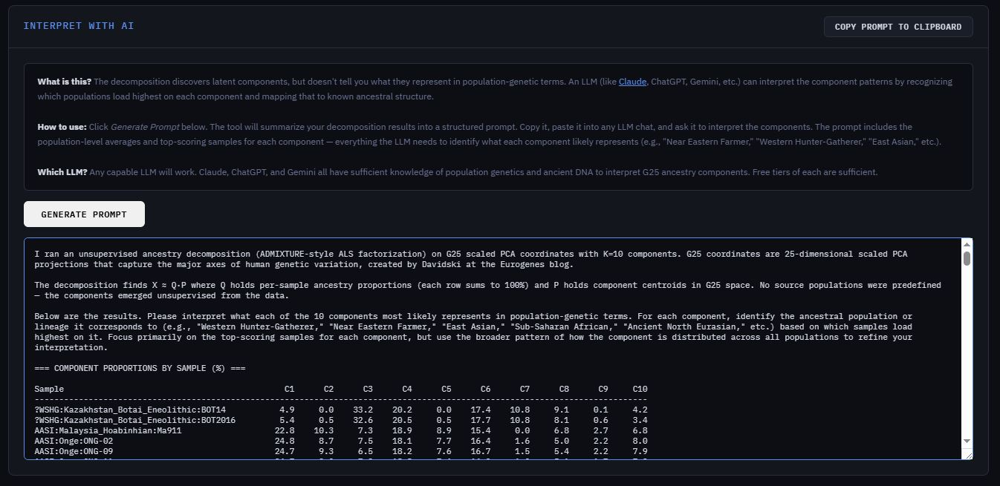

# G25 → Unsupervised Ancestry Decomposition

A browser-based tool that estimates ancestry mixtures from [Global25 (G25)](https://eurogenes.blogspot.com/2025/02/g25-available-again.html) PCA coordinates, producing the same kind of stacked bar charts you'd get from ADMIXTURE — but without telling it which populations to look for ahead of time.

No installation, no server, nothing to configure. Open the HTML file in any modern browser and it works.


---

## What this actually does

If you've used a tool like ADMIXTURE before, you already know the output: a chart where each person is a bar, and the bar is divided into colored segments — "40% this, 30% that, 30% the other thing." What you might not know is how much heavy machinery normally goes into producing that chart. ADMIXTURE and STRUCTURE work directly on raw genotypes, hundreds of thousands of SNPs, and they lean on real population-genetics assumptions like Hardy-Weinberg equilibrium to do it.

This tool skips all of that. It starts from G25 coordinates instead — 25 numbers per person that are already a compressed, PCA-based summary of genetic variation — and asks whether ancestry structure can be recovered from that compressed representation alone, with no reference populations chosen in advance. The components just have to emerge from the data.

That's useful if you want to:

- Poke at population structure in a batch of G25 samples without picking reference groups first
- Sanity-check what an ADMIXTURE run might show, without running the actual genotype pipeline
- See how populations relate to each other as mixtures rather than fixed categories
- Try different K values (number of components) interactively and watch the structure shift

### What it isn't

This is not a replacement for SNP-based ADMIXTURE, and it won't pretend to be. It works in a reduced 25-dimensional space, not on allele frequencies, so there's no population-genetic model underneath it — no HWE, no linkage assumptions. The "components" it finds are directions in PCA space, not literal ancestral populations, and any fine-scale structure that needs hundreds of thousands of SNPs to resolve simply isn't there to find. Treat the results as analogous to a real ADMIXTURE run, not identical to one.

---

## The algorithm, in two passes

**Plain version:** the tool is trying to explain each person's G25 coordinates as a mix of a small number of "ancestral profiles," where the mixing percentages for each person have to be non-negative and add up to 100%. It alternates between two questions — "given everyone's mixing percentages, what do the ancestral profiles look like?" and "given the profiles, what's each person's best mix?" — and keeps refining both until the numbers stop moving.

**Technical version**, for anyone who wants the actual method:

It's **Alternating Least Squares (ALS) with simplex-projected mixture proportions**.

Given an input matrix **X** (N samples × D = 25 coordinates), the tool solves for:

- **Q** (N × K) — per-sample mixture proportions, each row constrained to the probability simplex (non-negative, sums to 1)
- **P** (K × D) — ancestral component centroids in G25 space, left unconstrained since PCA coordinates can be negative

such that **X ≈ Q · P**, minimizing Frobenius reconstruction error.

The simplex constraint on Q is doing the real work here — it's what mirrors ADMIXTURE's requirement that ancestry fractions be non-negative and sum to one, and it's why you get genuine soft mixtures instead of the hard 0%/100% calls a Gaussian Mixture Model would hand you in high-dimensional space with few samples.

**The two update steps:**

1. **Fix Q, solve for P.** With Q held constant, this is ordinary least squares: P = (QᵀQ)⁻¹QᵀX, with a small ridge term (λ = 10⁻⁷) added to QᵀQ for stability. The K × K matrix is inverted by Gauss-Jordan elimination, which is fine since K stays small (typically 2–20).

2. **Fix P, solve for Q.** Each row of Q updates independently by minimizing ‖xᵢ − qᵢP‖² subject to qᵢ living on the simplex. This runs as projected gradient descent: compute the gradient (PᵀP · qᵢ − Pᵀxᵢ), take a step, then project back onto the simplex using Duchi et al.'s (2008) algorithm. Step size is 0.9 / tr(PᵀP), and each row gets 80 inner iterations.

**Initialization:** component centroids P start from **K-means++ seeding** — the first centroid picked at random, each next one chosen with probability proportional to its squared distance from the nearest existing centroid. This spreads the starting points out and makes the result far less sensitive to which random seed you happened to get, compared to plain random initialization. Q starts uniform (1/K per component) plus a little noise, then gets projected onto the simplex.

**Multiple restarts:** the objective isn't convex, so it can get stuck in local minima. The tool runs several independent restarts with different seeds and keeps whichever one reconstructs the data best.

**Convergence:** the algorithm stops once the change in mean squared reconstruction error between iterations drops below 10⁻¹², or when it hits the iteration cap, whichever comes first.

---

## Parameters

| Parameter | Default | Range | Effect |
|-----------|---------|-------|--------|
| **Mode** | Single K | Single K / Sweep K range | Run one K value, or test a range and compare them |
| **K** | 4 | 2–20 | Number of components to discover. Low K gives you a broad split; high K resolves finer structure but starts overfitting past a point. K=2 usually shows a continental-scale split; K=4–6 starts revealing sub-continental structure |
| **K max** | 10 | 3–20 | Upper end of the K range in sweep mode (the lower end is fixed at 2) |
| **Iterations** | 500 | 50–5000 | Max ALS iterations per run. 500 is normally enough to converge; bump it up for large or messy datasets |
| **Restarts** | 10 | 1–30 | Independent random restarts per K. More restarts lower the odds of landing in a bad local minimum, at the cost of runtime scaling linearly. 10 is a reasonable default; go to 20–30 if you want publication-quality stability |
| **Palette** | Classic | Classic / Earth Tones / Vibrant | Just the colors. No effect on the analysis |

### Picking a K

There's no "correct" K, same as with ADMIXTURE — different values just show you different levels of structure:

- **K=2:** the coarsest split (e.g., West Eurasian vs. everything else, in the sample data)
- **K=3–4:** major continental groupings show up
- **K=5–8:** sub-continental patterns emerge — Northern vs. Southern European, Near Eastern vs. South Asian, that sort of thing
- **K>10:** increasingly fine-grained, and increasingly likely to be fitting noise if your sample size is small

In sweep mode, the tool plots reconstruction error against K. Look for the elbow — the point where adding more components stops buying you much. It's the same idea as ADMIXTURE's cross-validation error plot.

---

## Input format

Standard G25/Vahaduo format — one sample per line, comma-separated:

```
Population_Label,coord1,coord2,coord3,...,coord25
```

For example:

```
English,0.0389,0.0596,0.0497,0.0167,0.003,-0.003,0.005,0.0014,...
Greek_Crete,0.0609,0.0845,0.0285,-0.0065,-0.0135,0.003,-0.0095,...
Yoruba,0.082,-0.012,-0.068,-0.059,0.01,-0.018,0.035,0.025,...
```

- Labels can use letters, numbers, underscores, and hyphens
- Coordinates can be positive or negative — G25 space is centered
- Lines starting with `#` are comments and get skipped
- The tool figures out the number of dimensions on its own (doesn't have to be exactly 25)
- A sample dataset of 32 world populations is built in — hit **Load Sample Data**

---

## Output

### Stacked bar chart

The classic ADMIXTURE-style plot: one bar per sample, colored segments showing each component's proportion. Three sort options:

- **Input** — original order from the pasted data
- **Cluster** — grouped by dominant component, then sorted by proportion within each group (usually the clearest view)
- **Name** — alphabetical

### Component proportions table

Every sample, its exact percentage on each component, and which component is dominant. Follows whatever sort order the chart is using.

### CSV export

**Export CSV** downloads the full proportions matrix, one row per sample, percentages from 0–100 for each component — ready to drop into R, Python, Excel, or wherever else you need it.

### Reconstruction error chart (sweep mode)

A bar chart of mean squared error per K, with the best-fitting K highlighted. Click any bar to jump to that decomposition. Lower is better.

---

## Interpreting results with AI



The decomposition tells you the components exist. It doesn't tell you what they mean. If a component peaks at 45% in Yoruba and Dinka samples, that's obviously capturing Sub-Saharan African ancestry — but "obviously" only holds if you already know something about population genetics. The algorithm doesn't.

This is where an LLM — [Claude](https://claude.ai), [ChatGPT](https://chat.openai.com), [Gemini](https://gemini.google.com), whichever you have handy — earns its keep. It can look at which populations load highest on each component and match that pattern against what's known from the ancient DNA literature.

### Built-in prompt generator

Once you've run a decomposition, an **Interpret with AI** panel shows up below the results. Click **Generate Prompt** and it builds a structured summary — population averages and top-scoring samples per component — formatted for any LLM to read. Copy it, paste it into your model of choice, done.

### Doing it by hand

If you'd rather write your own, export the CSV and adapt something like this:

```
I ran an unsupervised ancestry decomposition on G25 scaled PCA coordinates
with K=6 components. G25 coordinates are 25-dimensional scaled PCA projections
that capture the major axes of human genetic variation.

No source populations were predefined — the components emerged unsupervised.
Below are the component proportions for each sample (percentages, rows sum
to 100%).

[paste CSV contents here]

Please interpret what each of the 6 components most likely represents in
population-genetic terms (e.g., "Western Hunter-Gatherer," "Near Eastern
Farmer," "East Asian," etc.) based on which samples load highest on each
component.
```

### Getting better interpretations

- **Use informative population labels.** "Yoruba" and "Han_Chinese" give the model something to work with. "Sample_001" doesn't.
- **Say what K you used and give context on your dataset.** If everything's European, mention that — it changes how the model should read the components.
- **Follow up.** Once the components are labeled, you can ask things like "which of my samples show the most Near Eastern Farmer ancestry?" or "what's the historical story behind the split between Component 3 and Component 5?"
- **Any capable model works.** Free tiers of Claude, ChatGPT, and Gemini all know enough population genetics and ancient DNA to be useful here.

---

## Technical notes

- **Why not a Gaussian Mixture Model?** In 25 dimensions with relatively few samples, a GMM will plant a Gaussian right on top of each cluster and drive posterior responsibilities to 100%/0% — hard assignments, not the soft mixtures you actually want. The simplex-constrained factorization avoids this by construction, not by tuning.

- **Negative coordinates.** G25 coordinates can go negative, which rules out standard NMF. Here, only Q is forced non-negative; P stays unconstrained and can sit anywhere in coordinate space.

- **Simplex projection.** Projecting an arbitrary vector onto the probability simplex uses the O(n log n) method from Duchi, Shalev-Shwartz, Singer, and Chandra (2008).

- **Cost.** Runtime scales as O(restarts × iterations × N × K × D) for the Q-update. With defaults (10 restarts, 500 iterations, D=25), expect well under a second for datasets up to a few hundred samples, and a few seconds for datasets in the thousands.

- **Determinism.** Same parameters, same result, every time — the tool uses a seeded LCG rather than the browser's built-in randomness. Change K or the restart count and you get a different seed, so results shift accordingly.

---

## Running it

Open `g25-admixture-tool.html` in Chrome, Firefox, Safari, or Edge. It's all client-side JavaScript — nothing you paste in ever leaves your machine.

---

## License

GNU General Public License v3.0 — see [LICENSE](LICENSE) for the full text.

---

## References

- Alexander, D.H., Novembre, J., & Lange, K. (2009). Fast model-based estimation of ancestry in unrelated individuals. *Genome Research*, 19(9), 1655–1664.
- Duchi, J., Shalev-Shwartz, S., Singer, Y., & Chandra, T. (2008). Efficient Projections onto the ℓ₁-Ball for Learning in High Dimensions. *ICML 2008*.
- Pritchard, J.K., Stephens, M., & Donnelly, P. (2000). Inference of population structure using multilocus genotype data. *Genetics*, 155(2), 945–959.
- Lazaridis, I. et al. (2014). Ancient human genomes suggest three ancestral populations for present-day Europeans. *Nature*, 513(7518), 409–413.
- Global25 (G25) coordinates by Davidski: [Eurogenes Blog](https://eurogenes.blogspot.com/2025/02/g25-available-again.html)
