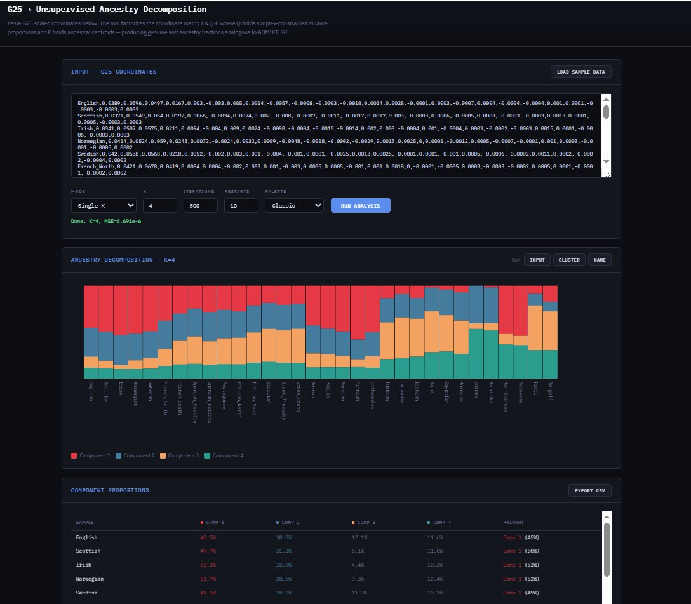

# G25 → Unsupervised Ancestry Decomposition

A browser-based tool that performs unsupervised ancestry decomposition on [Global25 (G25)](https://eurogenes.blogspot.com/2025/02/g25-available-again.html) scaled PCA coordinates — producing ADMIXTURE-style stacked bar plots and mixture proportions without any predefined source populations.

No installation, no server, no dependencies. Open the HTML file in any modern browser.



---

## Purpose

[ADMIXTURE](https://dalexander.github.io/admixture/) and [STRUCTURE](https://web.stanford.edu/group/pritchardlab/structure.html) are the standard tools for decomposing individuals into K ancestral components from raw genotype data. They operate on hundreds of thousands of SNPs and model population-genetic processes (Hardy-Weinberg equilibrium, linkage equilibrium within clusters).

This tool asks a different question: **can we achieve analogous results starting from G25 coordinates alone?** G25 coordinates are 25-dimensional scaled PCA projections that already capture the major axes of human genetic variation. By factorizing this coordinate matrix into latent components and per-sample mixture proportions, we can recover ancestry structure directly — letting clusters emerge from the data without specifying source populations.

This is useful when you want to:

- Explore population structure in a set of G25 samples without choosing reference populations
- Quickly prototype or sanity-check ADMIXTURE-like analyses without running the full genotype pipeline
- Visualize how populations relate to each other as mixtures of discovered components
- Experiment with different K values interactively

### What this is not

This tool does **not** replace SNP-based ADMIXTURE. It operates in a reduced 25-dimensional PCA space rather than on raw allele frequencies, so it has no explicit population-genetic model (no HWE, no LD assumptions). The discovered components are geometric directions in PCA space, not literal ancestral populations. Fine-scale structure that requires hundreds of thousands of SNPs to resolve may be lost. Results are analogous in spirit but not identical to SNP-based runs.

---

## Algorithm

The core algorithm is **Alternating Least Squares (ALS) with simplex-projected mixture proportions**.

### Problem formulation

Given an input matrix **X** of dimensions N × D (N samples, D = 25 coordinates), the tool finds:

- **Q** (N × K): per-sample mixture proportions — each row lies on the probability simplex (all entries ≥ 0, each row sums to 1)
- **P** (K × D): ancestral component centroids in G25 space (unconstrained, since PCA coordinates can be negative)

such that **X ≈ Q · P** minimizes the Frobenius reconstruction error.

The constraint on Q directly mirrors ADMIXTURE's requirement that ancestry fractions be non-negative and sum to unity. This is what produces genuine soft mixtures rather than the hard 0%/100% assignments that a Gaussian Mixture Model would give in high-dimensional space with few samples.

### Optimization

The algorithm alternates two steps until convergence:

1. **Fix Q, solve for P** — With Q held constant, the optimal P is the ordinary least-squares solution: P = (QᵀQ)⁻¹QᵀX. A small ridge term (λ = 10⁻⁷) is added to QᵀQ for numerical stability. The K × K matrix is inverted via Gauss-Jordan elimination (tractable since K is small, typically 2–20).

2. **Fix P, solve for Q** — With P held constant, each row of Q is updated independently by minimizing ‖xᵢ − qᵢP‖² subject to qᵢ being on the probability simplex. This is solved via projected gradient descent: compute the gradient (PᵀP · qᵢ − Pᵀxᵢ), take a gradient step, then project back onto the simplex using the algorithm of Duchi et al. (2008). The step size is set adaptively as 0.9 / tr(PᵀP). Each row runs 80 inner projected-gradient iterations.

### Initialization

Component centroids P are initialized using **K-means++ seeding**: the first centroid is chosen uniformly at random from the data, and each subsequent centroid is chosen with probability proportional to the squared distance to its nearest existing centroid. This spreads initial centroids across the data and substantially reduces sensitivity to random initialization compared to uniform random starts.

Q is initialized as uniform (1/K per component) plus small random noise, then projected onto the simplex.

### Multiple restarts

Because the objective is non-convex and can have local minima, the tool runs multiple independent restarts with different random seeds and keeps the result with the lowest reconstruction error.

### Convergence

The algorithm terminates when the change in mean squared reconstruction error between consecutive iterations falls below 10⁻¹², or when the maximum iteration count is reached.

---

## Parameters

| Parameter | Default | Range | Effect |
|-----------|---------|-------|--------|
| **Mode** | Single K | Single K / Sweep K range | Whether to run a single K value or test a range and compare |
| **K** | 4 | 2–20 | Number of ancestral components to discover. Higher K resolves finer structure but risks overfitting. At K=2 you typically see a broad continental split; at K=4–6, sub-continental structure emerges |
| **K max** | 10 | 3–20 | Upper bound of the K range when using sweep mode (lower bound is always 2) |
| **Iterations** | 500 | 50–5000 | Maximum ALS iterations per run. 500 is usually sufficient for convergence with the default data. Increase for very large or complex datasets |
| **Restarts** | 10 | 1–30 | Number of independent random restarts per K. More restarts reduce the chance of getting stuck in a poor local minimum but increase runtime linearly. 10 is a good balance; for publication-quality results, consider 20–30 |
| **Palette** | Classic | Classic / Earth Tones / Vibrant | Color scheme for the stacked bar chart and table. Purely aesthetic; does not affect the analysis |

### Choosing K

There is no single correct K — different values reveal different levels of population structure, just like in ADMIXTURE. Some guidelines:

- **K=2**: Coarsest split (e.g., West Eurasian vs. non-West Eurasian with the sample data)
- **K=3–4**: Major continental groupings emerge
- **K=5–8**: Sub-continental structure (e.g., Northern vs. Southern European, Near Eastern vs. South Asian)
- **K>10**: Increasingly fine-grained; risk of overfitting with small sample sizes

In **sweep mode**, the tool displays a reconstruction error chart. Look for the "elbow" — the K value beyond which adding more components yields diminishing reductions in error. This is analogous to ADMIXTURE's cross-validation error plot.

---

## Input Format

Standard G25/Vahaduo scaled coordinate format — one sample per line, comma-separated:

```
Population_Label,coord1,coord2,coord3,...,coord25
```

For example:

```
English,0.0389,0.0596,0.0497,0.0167,0.003,-0.003,0.005,0.0014,...
Greek_Crete,0.0609,0.0845,0.0285,-0.0065,-0.0135,0.003,-0.0095,...
Yoruba,0.082,-0.012,-0.068,-0.059,0.01,-0.018,0.035,0.025,...
```

- Labels can contain letters, numbers, underscores, and hyphens
- Coordinates can be positive or negative (G25 PCA space is centered)
- Lines starting with `#` are treated as comments and ignored
- The tool auto-detects the number of dimensions (need not be exactly 25)
- A built-in sample dataset of 32 world populations is available via the **Load Sample Data** button

---

## Output

### Stacked bar chart

The primary visualization is a classic ADMIXTURE-style stacked bar plot. Each vertical bar represents one sample, and the colored segments show the proportion attributed to each discovered component. Bars can be sorted three ways:

- **Input** — original order from the pasted data
- **Cluster** — grouped by dominant component, then sorted by proportion within each group (most useful for visual clarity)
- **Name** — alphabetical by sample label

### Component proportions table

A scrollable table listing every sample with its exact percentage for each component, plus the primary (largest) component assignment. The table respects the current sort order.

### CSV export

Click **Export CSV** to download the full proportions matrix as a comma-separated file suitable for further analysis in R, Python, Excel, or any other tool. The exported file contains one row per sample with percentage values (0–100) for each component.

### Reconstruction error chart (sweep mode)

When running a K sweep, the tool displays a bar chart of mean squared reconstruction error for each K value. Click any bar to view the decomposition at that K. Lower error indicates better fit; the highlighted bar marks the K with the lowest error.

---

## Technical Notes

- **Why not GMM?** A Gaussian Mixture Model in 25 dimensions with a small number of samples will place a Gaussian component directly on top of each cluster and drive posterior responsibilities to 100%/0%, producing hard assignments rather than soft mixtures. The simplex-constrained matrix factorization used here avoids this by construction.

- **Negative coordinates.** G25 PCA coordinates can be negative, which rules out standard Non-negative Matrix Factorization (NMF). In this algorithm, only Q (the mixture proportions) is constrained to be non-negative; P (the component centroids) is unconstrained and can take any values in the coordinate space.

- **Simplex projection.** The projection of an arbitrary vector onto the probability simplex uses the O(n log n) algorithm of Duchi, Shalev-Shwartz, Singer, and Chandra (2008), "Efficient Projections onto the ℓ₁-Ball for Learning in High Dimensions."

- **Computational cost.** Runtime scales as O(restarts × iterations × N × K × D) for the Q-update step. With the defaults (10 restarts, 500 iterations, D=25), runs complete in under a second for datasets up to several hundred samples. Datasets with thousands of samples may take several seconds.

- **Determinism.** Results are deterministic for a given set of parameters — the tool uses a seeded linear congruential generator (LCG) for reproducibility. Different K values or restart counts will yield different seeds and potentially different results.

---

## Running

Open `g25-admixture-tool.html` in any modern browser (Chrome, Firefox, Safari, Edge). Everything runs client-side in JavaScript — no data leaves your machine.

---

## License

MIT

---

## References

- Alexander, D.H., Novembre, J., & Lange, K. (2009). Fast model-based estimation of ancestry in unrelated individuals. *Genome Research*, 19(9), 1655–1664.
- Duchi, J., Shalev-Shwartz, S., Singer, Y., & Chandra, T. (2008). Efficient Projections onto the ℓ₁-Ball for Learning in High Dimensions. *ICML 2008*.
- Pritchard, J.K., Stephens, M., & Donnelly, P. (2000). Inference of population structure using multilocus genotype data. *Genetics*, 155(2), 945–959.
- Lazaridis, I. et al. (2014). Ancient human genomes suggest three ancestral populations for present-day Europeans. *Nature*, 513(7518), 409–413.
- Global25 (G25) coordinates by Davidski: [Eurogenes Blog](https://eurogenes.blogspot.com/2025/02/g25-available-again.html)
